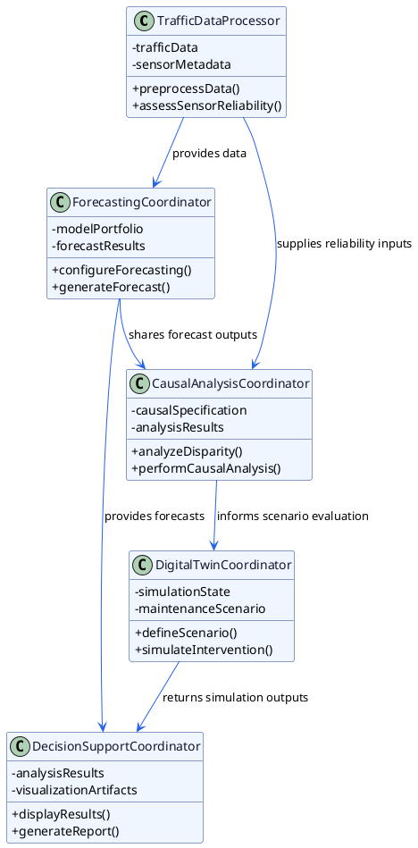
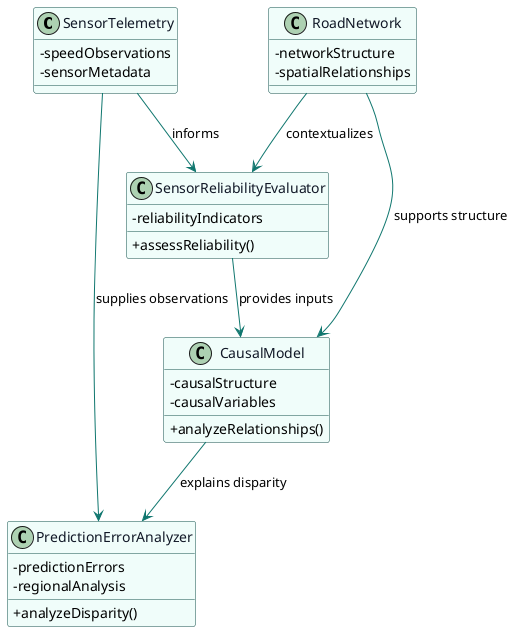
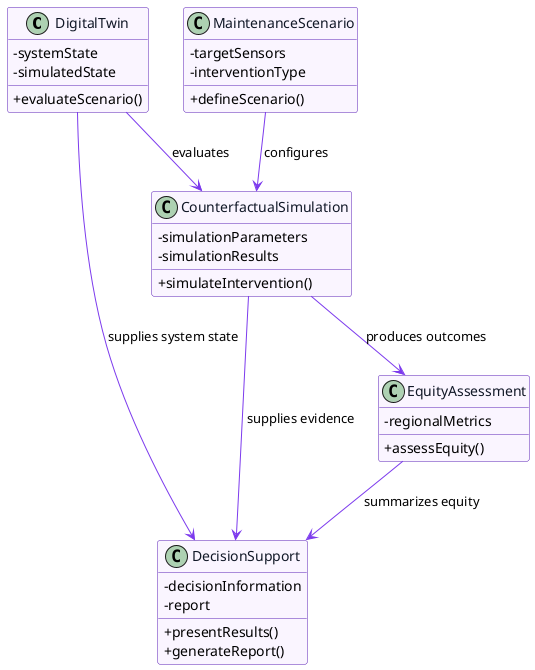
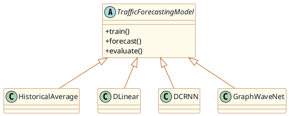

# UML Class Diagrams

## Figure 1. Conceptual UML Class Diagram - Structural Causal Digital Twin Framework

This conceptual diagram presents the major software responsibilities proposed for the framework and shows how information flows from telemetry preparation through forecasting, causal analysis, digital-twin simulation, and decision support. The horizontal package layout improves readability and emphasizes the high-level architecture rather than implementation details.

## Figure 2. Conceptual UML Class Diagram - Sensor Reliability and Causal Analysis

This diagram isolates the conceptual analytical path from telemetry and network context to reliability assessment and causal reasoning. The package structure clarifies the analytical responsibilities without introducing implementation-level details or mathematical subcomponents.

## Figure 3. Conceptual UML Class Diagram - Digital Twin and Decision Support

This diagram captures the proposed maintenance decision workflow inside the digital twin. The package grouping makes the scenario, simulation, equity, and reporting stages explicit while keeping the figure compact and proposal-stage appropriate.

## Figure 4. Conceptual UML Class Diagram - Forecasting Model Hierarchy

This hierarchy presents the forecasting approaches as alternative implementations of a shared conceptual forecasting model. The abstract base class and package separation support comparative evaluation while avoiding internal architectural details that belong in the methodology chapter rather than the class diagram.
