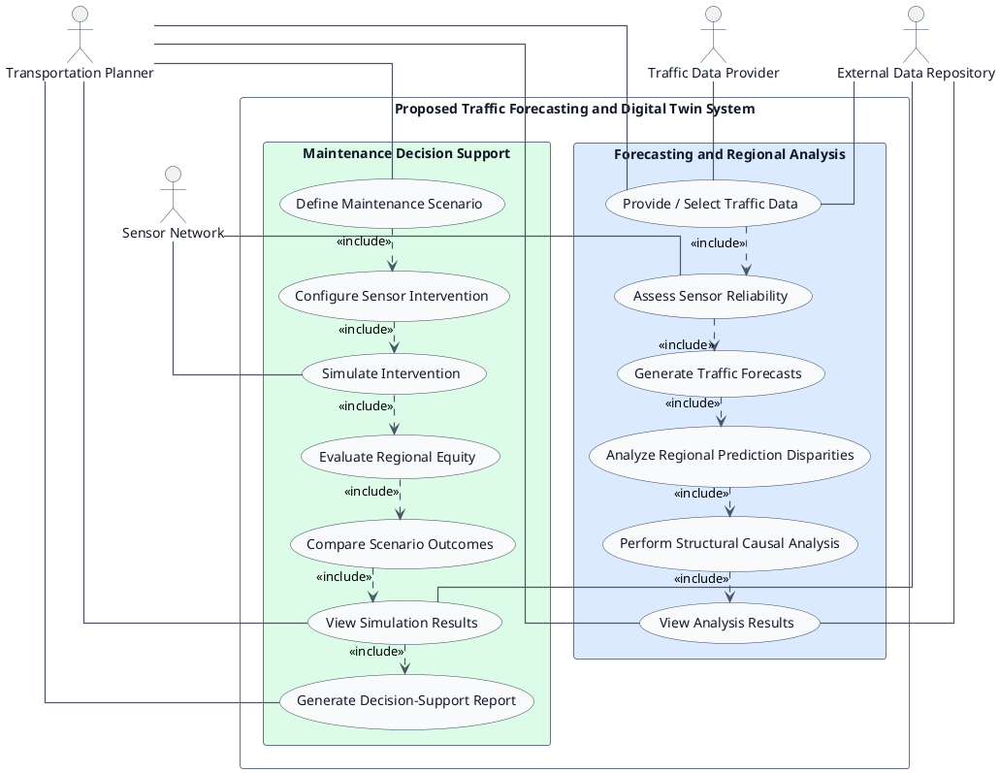

# UML Use Case Diagram

## Use Case Diagram - Forecasting, Regional Analysis, and Maintenance Decision Support

This diagram keeps the proposal-stage system conceptually clean while showing both major use-case areas. The Transportation Planner is the primary human actor, and the technical actors represent external integration points for traffic data, sensors, and stored results.
